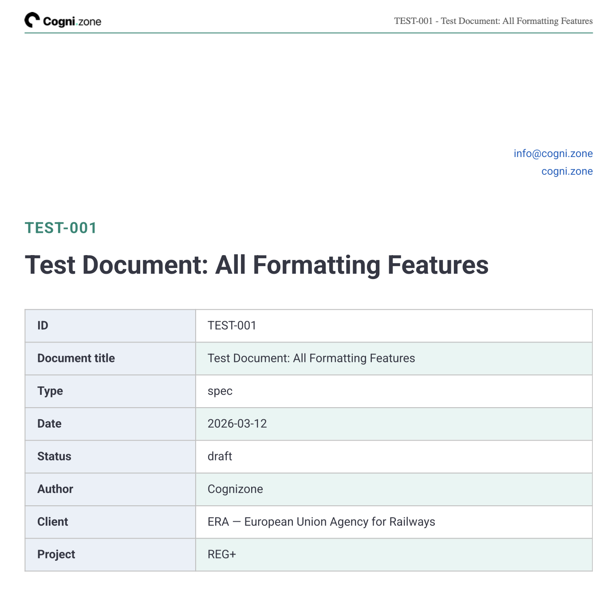
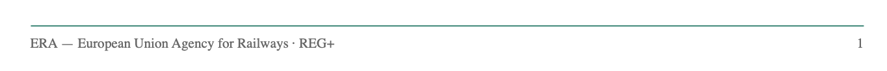
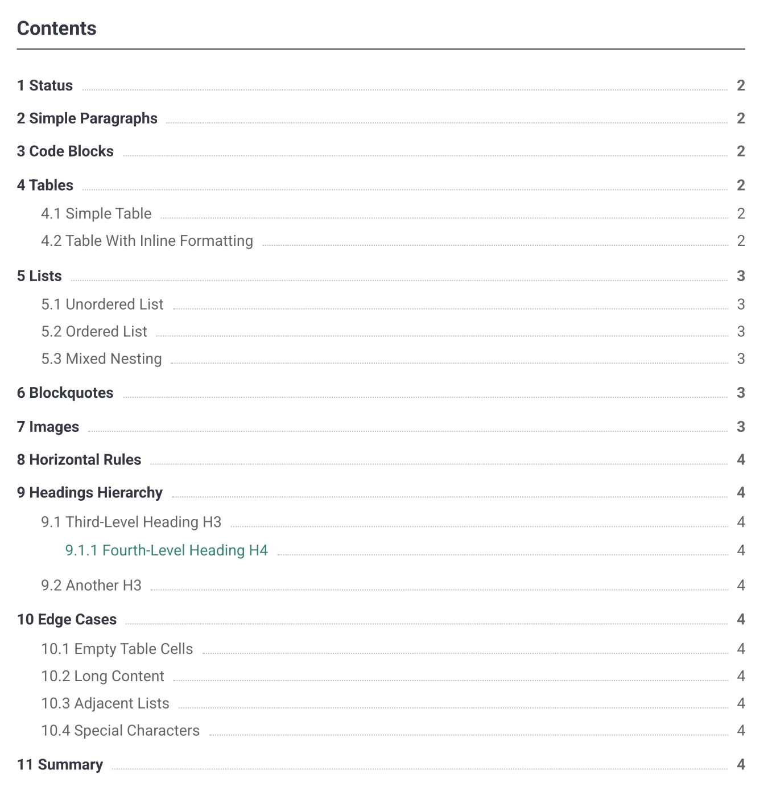
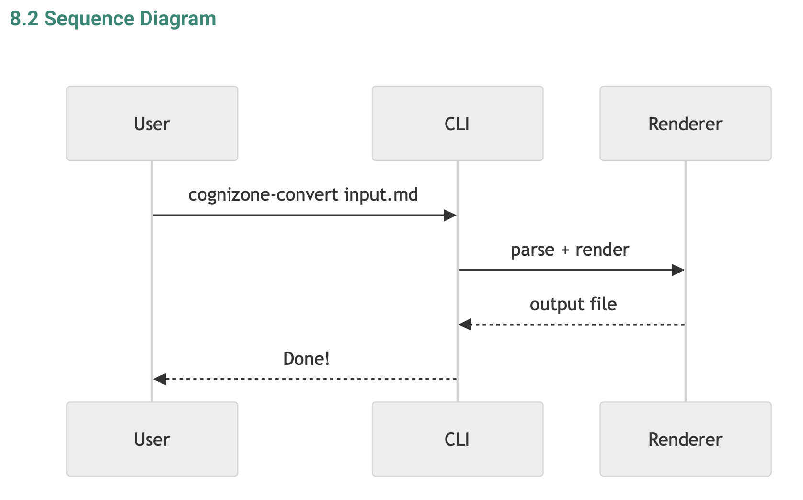
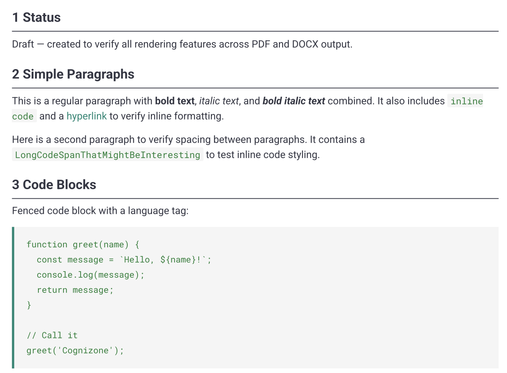

# @cognizone/brand-docs

Cognizone branded document conversion. Converts Markdown files to PDF, Word (.docx), or HTML using Cognizone brand styles (colors, fonts, layout).

Works on macOS, Linux, and Windows — no bash or pandoc required.

## Features

- **PDF, Word, and HTML output** from a single Markdown source
- **Self-contained HTML** — a single `.html` file with fonts, images, logo, and mermaid embedded; opens offline in any browser
- **Folder merge** — pass a folder to combine all Markdown files into a single PDF or HTML file with a master cover page and TOC
- **Branded cover page** with document ID, title, and metadata table
- **Auto-generated table of contents** with section numbers and page references
- **Branded headers and footers** with logo, document title, client/project info, and page numbers
- **Mermaid diagrams** — `\`\`\`mermaid` code blocks render as visual diagrams (flowcharts, sequence diagrams, etc.)
- **Full Markdown support** — headings, tables, lists (nested/mixed), code blocks, blockquotes, images, links, inline formatting
- **HTML `` tags** with width/height for precise image sizing
- **YAML frontmatter** for document metadata (title, id, type, status, date, author, client, project)
- **Cognizone brand styles** — colors, Roboto/Roboto Mono fonts, A4 layout
- **Cross-platform** — pure Node.js, no bash or pandoc dependency

## Requirements

- [Node.js](https://nodejs.org/) ≥ 18

## Installation

```bash
npm install -g cognizone/cognizone-brand-docs
```

To update to the latest version, run the same command again.

## Usage

```bash
cognizone-convert document.md                        # converts to PDF (default)
cognizone-convert document.md --format docx          # converts to Word
cognizone-convert document.md --format html          # converts to self-contained HTML
cognizone-convert document.md -f docx                # short form
cognizone-convert document.md output/custom-name.pdf # custom output path

# Folder merge (PDF or HTML)
cognizone-convert docs/                              # merges all .md files → docs.pdf
cognizone-convert docs/ -f html                      # merges all .md files → docs.html
cognizone-convert docs/ merged-output.pdf            # custom output path
```

> **Note (Word output):** Word documents reference fonts by name. For correct rendering, install [Roboto](https://fonts.google.com/specimen/Roboto) and [Roboto Mono](https://fonts.google.com/specimen/Roboto+Mono) on the machine opening the `.docx` file.

## Document format

Input files should be Markdown with YAML frontmatter:

```yaml
---
title: "My Document Title"
id: ADR-001
type: adr
status: draft
date: 2025-01-01
author: Cognizone
client: "ERA — European Union Agency for Railways"
project: REG+
---
```

All fields are optional. Supported frontmatter fields: `title`, `id`, `type`, `status`, `version`, `date`, `author`, `client`, `project`.

## Sizing mermaid diagrams

Add options to the fence line to control per-diagram width and alignment. Applies to PDF, DOCX, and HTML output.

````markdown

````

| Option | Values | Default | Effect |
|---|---|---|---|
| `maxWidth` | integer pixels | `500` | Upper bound on rendered width; height scales proportionally |
| `align` | `left`, `center`, `right` | `center` | Paragraph alignment of the diagram |

Unknown or invalid values are ignored with a warning on stderr; the diagram still renders with defaults.

## Output preview

Sample outputs generated from the [test fixture](test/fixture.md): [PDF](test/output/fixture.pdf) | [Word](test/output/fixture.docx)

PDF output with Cognizone brand styling:

### Cover page with header



### Footer



### Table of contents



### Mermaid diagrams



### Body content


