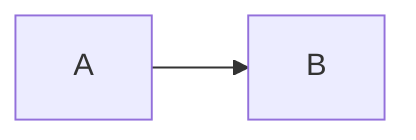
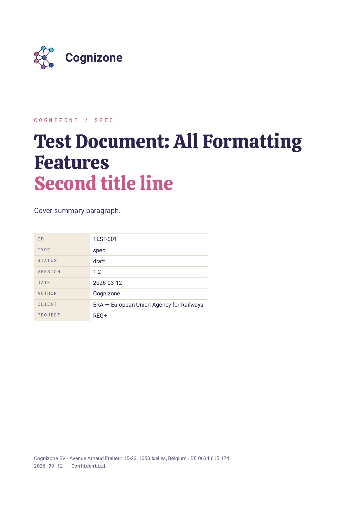
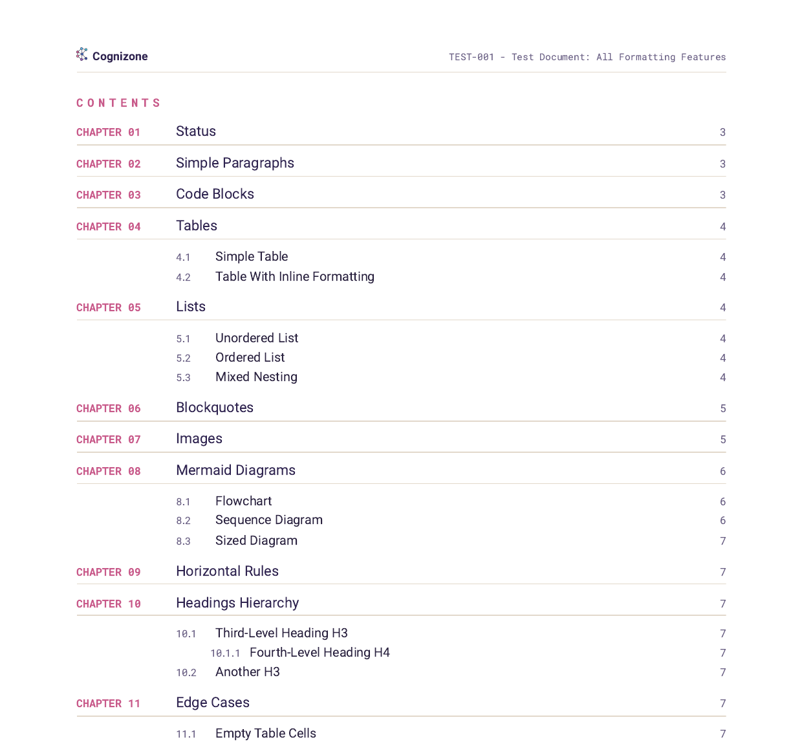
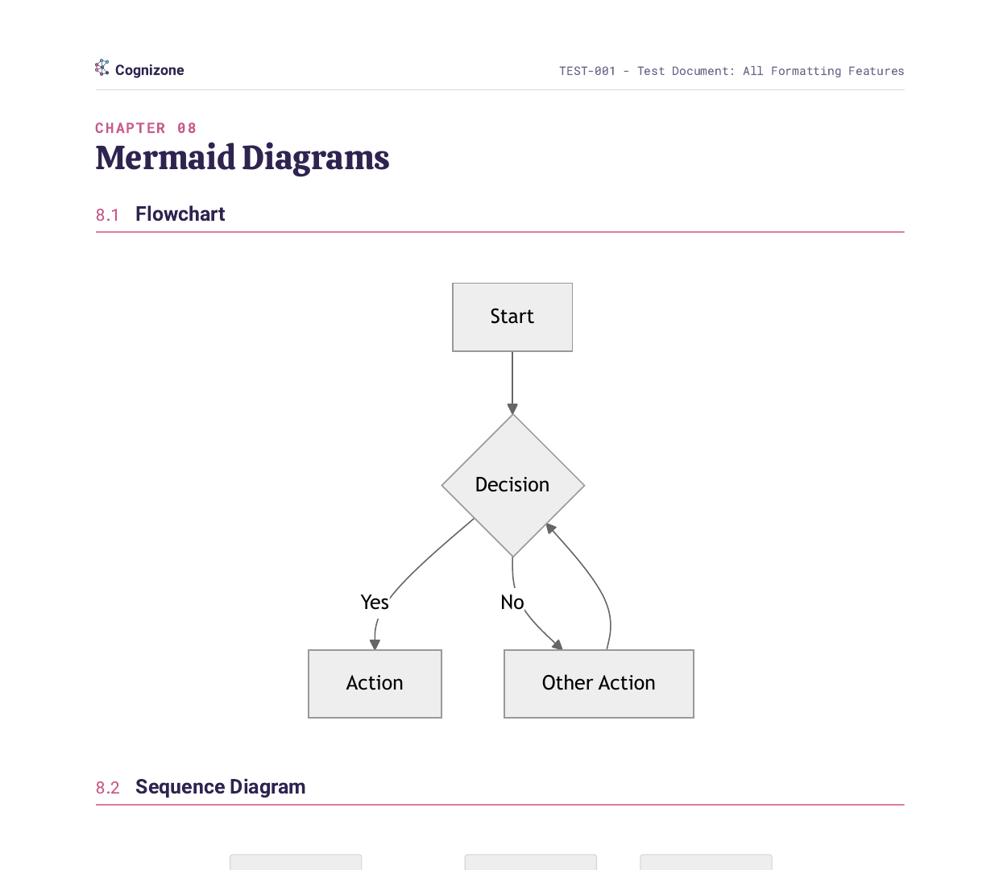
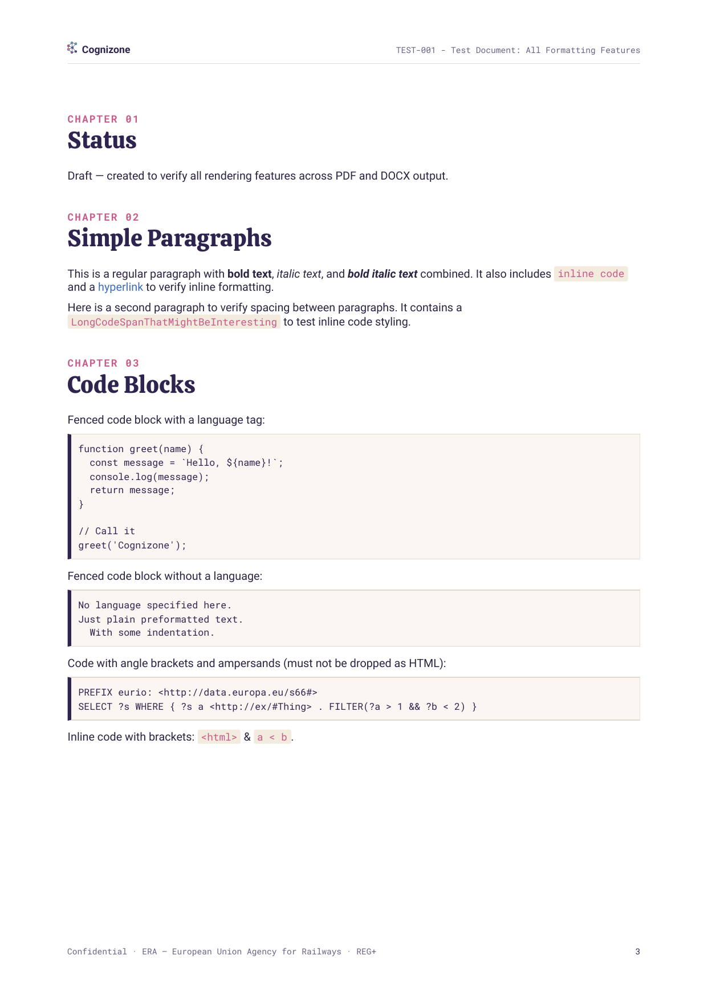

# @cognizone/brand-docs

Cognizone branded document conversion. Converts Markdown files to PDF, Word (.docx), or HTML using Cognizone brand styles (colors, fonts, layout).

Works on macOS, Linux, and Windows — no bash or pandoc required.

## Features

- **PDF, Word, and HTML output** from a single Markdown source
- **Self-contained HTML** — a single `.html` file with fonts, images, logo, and mermaid embedded; opens offline in any browser
- **Folder merge** — pass a folder to combine all Markdown files into a single PDF or HTML file with a master cover page and TOC
- **Branded cover page** with document ID, title, and metadata table
- **Auto-generated table of contents** with section numbers and page references
- **Branded headers and footers** with logo, document title, client/project info, and page numbers
- **Mermaid diagrams** — `\`\`\`mermaid` code blocks render as visual diagrams (flowcharts, sequence diagrams, etc.)
- **Full Markdown support** — headings, tables, lists (nested/mixed), code blocks, blockquotes, images, links, inline formatting
- **HTML `` tags** with width/height for precise image sizing
- **YAML frontmatter** for document metadata (title, subtitle, summary, id, type, status, version, date, author, client, project, classification)
- **Cognizone 2026 brand** — plum / cream colours, Calistoga titles, Roboto / Roboto Mono text, A4 layout (the old brand is still available with `-b classic` for a short transition)
- **Cross-platform** — pure Node.js, no bash or pandoc dependency

## Requirements

- [Node.js](https://nodejs.org/) ≥ 18 with npm (check with `node -v` and `npm -v`)
- Access to the `cognizone/cognizone-brand-docs` GitHub repository (the package installs from it)

Works the same on macOS, Windows and Linux.

## Installation

```bash
npm install -g cognizone/cognizone-brand-docs
cognizone-convert --version
```

To update to the latest version, run the same install command again.

PDF and Word output render through a headless Chrome. Recent npm versions skip install scripts by default (you may see `npm warn install-scripts ... puppeteer`), so Chrome is downloaded automatically the first time you convert a document (about 150 MB, once, into `~/.cache/puppeteer`; on Windows `%USERPROFILE%\.cache\puppeteer`). HTML output needs no browser.

### Fonts for Word output

Word documents reference fonts by name, so install [Calistoga](https://fonts.google.com/specimen/Calistoga), [Roboto](https://fonts.google.com/specimen/Roboto) and [Roboto Mono](https://fonts.google.com/specimen/Roboto+Mono) on the machine that opens the `.docx` (PDF and HTML embed their fonts):

- **macOS** — double-click each `.ttf` and click *Install* (Font Book)
- **Windows** — right-click each `.ttf` → *Install for all users*
- **Linux** — copy the `.ttf` files to `~/.local/share/fonts/` and run `fc-cache -f`

### Troubleshooting

| Problem | Fix |
|---|---|
| `command not found: cognizone-convert` | npm's global bin folder is not on your `PATH`. It is `$(npm prefix -g)/bin` on macOS/Linux and the `npm prefix -g` folder itself on Windows. Open a new terminal after changing `PATH`. |
| `EACCES` / permission error on install (macOS/Linux) | Don't use `sudo`; install Node with a version manager ([Volta](https://volta.sh), [nvm](https://github.com/nvm-sh/nvm)) so global installs go to your home folder. |
| 404 or authentication error on install | Check that your GitHub account has access to the Cognizone organisation. |
| `Could not find Chrome` | Run `npx puppeteer browsers install chrome`. On a minimal Linux install Chrome may also need system libraries; see the [Puppeteer troubleshooting guide](https://pptr.dev/troubleshooting). |
| Word contents page shows `–` or wrong page numbers | Choose **References → Update Table → Update page numbers only**. "Update entire table" replaces the 2026 styling with Word's default look. |

## Usage

```bash
cognizone-convert document.md                        # converts to PDF (default)
cognizone-convert document.md --format docx          # converts to Word
cognizone-convert document.md --format html          # converts to self-contained HTML
cognizone-convert document.md -f docx                # short form
cognizone-convert document.md output/custom-name.pdf # custom output path

# Folder merge (PDF or HTML)
cognizone-convert docs/                              # merges all .md files → docs.pdf
cognizone-convert docs/ -f html                      # merges all .md files → docs.html
cognizone-convert docs/ merged-output.pdf            # custom output path
```

All output uses the 2026 Cognizone brand; no flag is needed.

A Word file opens with `–` in place of the contents page numbers. To fill them in, choose **References → Update Table → Update page numbers only** in Word. Don't pick "Update entire table": it replaces the 2026 styling with Word's default look.

### Using it from Claude Code

Claude Code picks the tool up from the shell like any other command. To make it the default for client-facing documents, add a short section to your `~/.claude/CLAUDE.md`:

```markdown
## Cognizone branded documents
Render client-facing Markdown deliverables with `cognizone-convert` (`-f pdf|docx|html`),
never with plain pandoc. It uses the 2026 Cognizone brand by default.
```

## Document format

Input files should be Markdown with YAML frontmatter:

```yaml
---
title: "My Document Title"
id: ADR-001
type: adr
status: draft
date: 2025-01-01
author: Cognizone
client: "ERA — European Union Agency for Railways"
project: REG+
---
```

All fields are optional. Supported frontmatter fields: `title`, `id`, `type`, `status`, `version`, `date`, `author`, `client`, `project`, plus `subtitle`, `summary`, `classification` and `brand` (see [Brands](#brands)).

## Brands

The 2026 Cognizone brand (plum / cream, Calistoga titles) is the default. The old brand is kept for a short transition and will be removed:

```bash
cognizone-convert document.md -b classic             # old brand, any format
```

Or set `brand: classic` in a document's frontmatter (the `-b` / `--brand` flag wins over it). For a folder merge without `--brand`, the first document's `brand:` decides for the whole folder.

Extra optional frontmatter fields used by the 2026 cover and footer:

| Field | Use |
|---|---|
| `subtitle` | Second title line, in pink |
| `summary` | Paragraph under the title |
| `classification` | e.g. `Confidential`, shown on the cover and in the footer |

The style spec is [`reference/brand-2026-spec.md`](reference/brand-2026-spec.md); the logo pack is in [`assets/brand-2026/`](assets/brand-2026/).

## Links in delivered documents

Markdown in a repo links to GitHub, to other docs by relative path, and to headings in the same doc. A Word or PDF file handed to a client can't follow most of those, so three options control what happens to links. By default every link is kept as written.

| Option | Effect |
|---|---|
| `--no-external-links` | Links to sites and other files become plain text (the text and its formatting stay). `#heading` links in the same document still work. |
| `--relative-links` | A relative link to another `.md` points at that doc's converted file: `../EVR-10/case-model.md#states` → `../EVR-10/case-model.docx`. |
| `--link-base <url>` | As `--relative-links`, but the link is a full web address: `<url>` + the target's path from the folder you run the command from. |

All three work for PDF, Word and HTML. `--relative-links` and `--link-base` apply to single files only (a folder merge is one file), and they drop the `#section`: the link opens the other doc at its start.

### Word files on SharePoint

Word for the web can't follow relative links (it opens `https://../EVR-10/case-model.docx`), so use `--link-base` for a SharePoint delivery:

1. Link docs to each other with **relative paths** in the Markdown, not GitHub URLs. GitHub URLs are not rewritten; with `--no-external-links` they become plain text.
2. Upload the Word files with the **same folder layout** as the repo.
3. Run each conversion from the folder that maps to the SharePoint folder, passing that SharePoint folder's address:

```bash
cognizone-convert specs/EVR-13/EVR-13-search.md -f docx --no-external-links \
  --link-base "https://<tenant>.sharepoint.com/sites/<site>/<library>/Forms/AllItems.aspx?id=..."
```

- Paste the address straight from the browser's address bar while viewing the folder; the `AllItems.aspx?id=…` form is understood. A short "Copy link" sharing address (`/:f:/s/…`) has no folder path in it and does not work.
- SharePoint links get `?web=1`, so the file opens in Word for the web instead of downloading.
- A link to a doc outside the folder you run from can't be made absolute: with `--no-external-links` it becomes plain text, otherwise it stays relative (with a warning).
- A link to a doc you don't upload is broken, and moving or renaming the SharePoint folder means rebuilding with the new address.

`--relative-links` only suits HTML, or Word files opened from a OneDrive-synced folder; in a PDF, Chrome turns relative links into absolute paths on the machine that made it.

## Sizing mermaid diagrams

Add options to the fence line to control per-diagram width and alignment. Applies to PDF, DOCX, and HTML output.

````markdown

```mermaid maxWidth=300 align=left
flowchart LR
  A --> B
```
````

| Option | Values | Default | Effect |
|---|---|---|---|
| `maxWidth` | integer pixels | `500` | Upper bound on rendered width; height scales proportionally |
| `align` | `left`, `center`, `right` | `center` | Paragraph alignment of the diagram |

Unknown or invalid values are ignored with a warning on stderr; the diagram still renders with defaults.

## Output preview

Sample outputs generated from the [test fixture](test/fixture.md): [PDF](test/output/brand-2026.pdf) | [Word](test/output/brand-2026.docx)

PDF output in the 2026 Cognizone brand:

### Cover page



### Footer


### Table of contents



### Mermaid diagrams



### Body content


