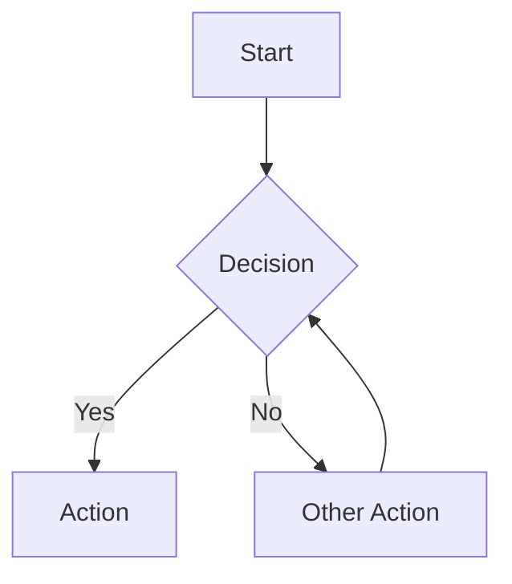
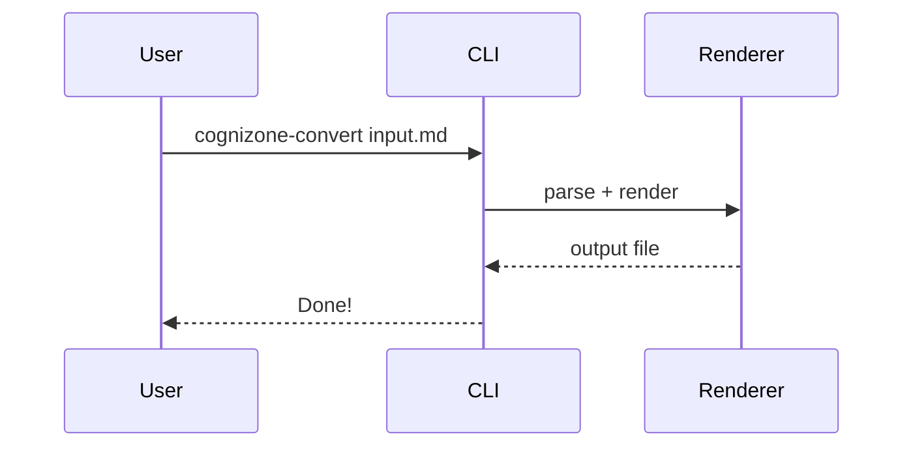
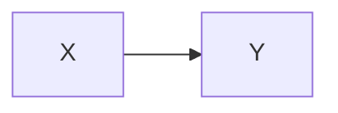

# TEST-001: Test Document

## Status

Draft — created to verify all rendering features across PDF and DOCX output.

## Simple Paragraphs

This is a regular paragraph with **bold text**, *italic text*, and ***bold italic text*** combined. It also includes `inline code` and a [hyperlink](https://cogni.zone) to verify inline formatting.

Here is a second paragraph to verify spacing between paragraphs. It contains a `LongCodeSpanThatMightBeInteresting` to test inline code styling.

## Code Blocks

Fenced code block with a language tag:

```javascript
function greet(name) {
  const message = `Hello, ${name}!`;
  console.log(message);
  return message;
}

// Call it
greet('Cognizone');
```

Fenced code block without a language:

```
No language specified here.
Just plain preformatted text.
  With some indentation.
```

## Tables

### Simple Table

| Column A | Column B | Column C |
|----------|----------|----------|
| Row 1 A  | Row 1 B  | Row 1 C  |
| Row 2 A  | Row 2 B  | Row 2 C  |
| Row 3 A  | Row 3 B  | Row 3 C  |
| Row 4 A  | Row 4 B  | Row 4 C  |
| Row 5 A  | Row 5 B  | Row 5 C  |

### Table With Inline Formatting

| Feature | Status | Notes |
|---------|--------|-------|
| **Bold header** | `done` | Uses *italic* note |
| Links | done | See [cogni.zone](https://cogni.zone) |
| Mixed | pending | Has **bold**, *italic*, and `code` |

## Lists

### Unordered List

- First item
- Second item with **bold**
- Third item with `code`
  - Nested item one
  - Nested item two
    - Deeply nested item
- Fourth item

### Ordered List

1. First step
2. Second step with *emphasis*
3. Third step
   1. Sub-step A
   2. Sub-step B
      1. Sub-sub-step
4. Fourth step

### Mixed Nesting

- Unordered parent
  1. Ordered child one
  2. Ordered child two
- Another unordered
  - Bullet child
    1. Ordered grandchild

## Blockquotes

> This is a simple blockquote to verify italic styling and the green left border.

> Multi-line blockquote that spans more than one line to verify that longer
> content wraps properly and maintains consistent styling throughout.

## Images

An inline image reference:


Resized via HTML tag (100x21):


## Mermaid Diagrams

### Flowchart



### Sequence Diagram



### Sized Diagram



## Horizontal Rules

Content above the rule.

---

Content below the rule.

## Headings Hierarchy

### Third-Level Heading (H3)

Content under H3 to verify green color and section numbering.

#### Fourth-Level Heading (H4)

Content under H4 to verify dark2 color and deeper numbering (e.g. 7.1.1).

### Another H3

Back to H3 to verify counter resets properly.

## Edge Cases

### Empty Table Cells

| Has Content | Empty | Also Empty |
|-------------|-------|------------|
| Yes         |       |            |
|             | Yes   |            |

### Long Content

This paragraph contains a very long inline code span: `this-is-a-really-long-code-span-that-might-cause-wrapping-issues-in-both-pdf-and-docx-output-formats` to verify how both renderers handle overflow.

### Adjacent Lists

First list:

- Alpha
- Beta

Second list immediately after:

- Gamma
- Delta

### Special Characters

Ampersand & angle brackets < > and quotes "double" 'single' plus an em dash — and ellipsis... should all render correctly.

## Summary

This document exercises:

- All heading levels (H2, H3, H4)
- Section numbering
- Paragraphs with inline formatting (bold, italic, bold+italic, code, links)
- Fenced code blocks (with and without language)
- Tables (simple, with formatting, with empty cells)
- Lists (ordered, unordered, nested, mixed)
- Blockquotes
- Horizontal rules
- Special characters
- Cover page with all frontmatter fields
- Table of contents generation
- Headers and footers
